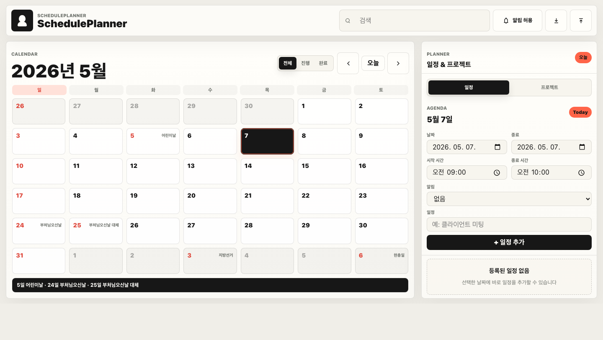

# SchedulePlanner

SchedulePlanner는 일정과 프로젝트를 한 화면에서 정리하는 정적 웹 플래너입니다. 아이보리 배경과 블루 계열 포인트 컬러를 사용해 밝고 차분한 분위기를 만들었고, 캘린더·아젠다·프로젝트를 한 화면에서 함께 볼 수 있도록 구성했습니다.

(https://design-schedule-deploy.vercel.app)

## 구현 이미지



위 화면은 SchedulePlanner의 메인 작업 화면입니다.

- 상단에는 프로필, 검색창, 데이터 내보내기/가져오기 버튼을 배치했습니다.
- 요약 영역에서는 진행 프로젝트, 오늘 일정, 7일 내 마감, 주간 리듬을 빠르게 확인할 수 있습니다.
- 왼쪽의 큰 캘린더는 월간 일정과 프로젝트 기간을 함께 보여줍니다.
- 오른쪽의 Agenda 영역에서는 선택한 날짜의 일정을 추가하고 관리할 수 있습니다.
- Projects 영역에서는 프로젝트 기간, 분류, 색상, 상태를 관리할 수 있습니다.

## 주요 기능

- 월간 캘린더에서 일정과 프로젝트 기간 확인
- 선택한 날짜의 일정 추가, 수정, 완료, 삭제
- 프로젝트 시작일, 종료일, 분류, 색상, 상태 관리
- 검색어 기반 일정/프로젝트 동시 필터링
- 프로필 이름, 소개, 사진 변경
- JSON 데이터 내보내기와 가져오기
- PWA용 favicon, app icon, manifest 제공

## 디자인 방향

- **색상**: 아이보리 바탕에 스카이 블루와 오션 블루를 포인트로 사용
- **레이아웃**: 캘린더를 가장 넓게 두고, Agenda와 Projects를 보조 패널로 배치
- **타이포그래피**: 큰 제목과 굵은 숫자로 정보 우선순위를 명확하게 표현
- **아이콘**: 작은 크기에서도 식별 가능한 단순한 `S` 모노그램 기반 아이콘 사용
- **반응형**: 좁은 화면에서는 패널을 세로로 재배치해 내용이 깨지지 않도록 처리

## 파일 구조

```text
.
├── index.html
├── src/
│   ├── app.js
│   └── styles.css
├── assets/
│   ├── icons/
│   │   ├── favicon-blue.svg
│   │   ├── app-icon-blue.svg
│   │   ├── apple-touch-icon-blue.png
│   │   ├── icon-192-blue.png
│   │   └── icon-512-blue.png
│   └── readme/
│       ├── preview.png
│       └── favicon-preview.png
├── site.webmanifest
├── vercel.json
└── README.md
```

## 로컬 실행

빌드 과정이 없는 정적 앱입니다. `index.html`을 브라우저로 직접 열어도 동작합니다.

로컬 서버로 확인하려면 프로젝트 폴더에서 아래 명령어를 실행합니다.

```bash
python3 -m http.server 4173
```

접속 주소:

```text
http://localhost:4173
```

## 배포

Vercel CLI 기준:

```bash
npx vercel deploy --prod --yes
```

현재 프로덕션 URL:

```text
https://design-schedule-deploy.vercel.app
```

## 구현 메모

- 앱 상태는 브라우저 `localStorage`에 저장됩니다.
- 외부 빌드 도구 없이 HTML, CSS, JavaScript만 사용합니다.
- README 이미지는 `assets/readme`에 보관해 GitHub에서도 바로 렌더링되도록 했습니다.
- 배포 캐시를 피하기 위해 현재 HTML과 manifest는 `*-blue` 아이콘 파일을 참조합니다.
